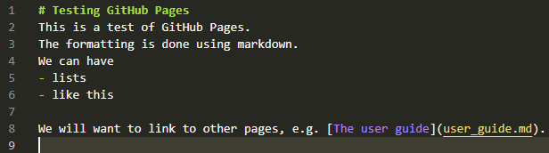

# Testing GitHub Pages
This is a test of GitHub Pages.
The formatting is done using markdown.
We can have
- lists
- like this

We will want to link to other pages, e.g. [The user guide](user_guide.md).

It's also likely that we'll want some screenshots.

We can also link to pages in subfolders, e.g. [Another page](subfolder/user_guide.md).
And embed images from subfolders, e.g. .
